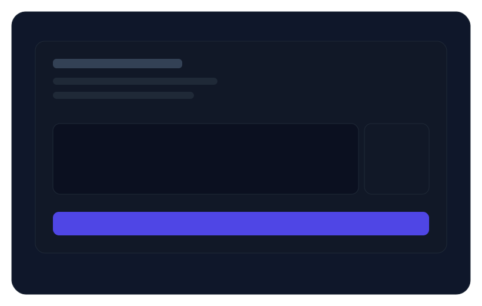

<link rel="stylesheet" href="assets/style.css">

<header>
  

    

      Windows 截图翻译 · 免费 OCR · 一键翻译
      <h1 class="title">ScreenshotTranslator</h1>
      
一款 Windows 截图翻译工具，集成区域截图、标注编辑、OCR 识别与自动翻译。无需安装运行时，下载即用。

      

        <a class="btn primary" href="https://github.com/zk-studio/--/releases/latest" target="_blank">下载最新版</a>
        <a class="btn" href="https://github.com/zk-studio/--/releases" target="_blank">历史版本</a>
      

      
提示：进入 Release 页面后，在 Assets 区域下载 zip 包。

    

    

      
    

  

</header>

<section class="section">
  

    

      <h3>截图更快</h3>
      
区域截图、全屏截图、窗口截图，快捷键即刻唤起。

    

    

      <h3>标注更全</h3>
      
矩形、椭圆、箭头、画笔、文字、马赛克，轻松表达重点。

    

    

      <h3>翻译更准</h3>
      
Windows 内置 OCR + 免费翻译接口，一键翻译截图文字。

    

  

</section>

<section class="section shots">
  

    
    
  

</section>

<section class="section">
  

    

      <h3>核心功能</h3>
      
区域截图 / 全屏截图 / 延时截图 / 窗口截图 / 钉图

      
标注：矩形、椭圆、箭头、画笔、荧光笔、文字、马赛克

      
OCR：多语言识别，一键复制文字

      
翻译：识别结果自动翻译，可覆盖显示在原图上

    

    

      <h3>常用快捷键</h3>
      

        
区域截图Ctrl+Shift+A

        
全屏截图Ctrl+Shift+F

        
截图翻译Ctrl+Shift+T

        
OCR 识别Ctrl+Shift+O

      

    

  

</section>

<section class="section">
  

    <h3>安装与使用</h3>
    
1) 点击上方“下载最新版”进入 Releases 页面。

    
2) 在 Assets 区域下载 zip 包并解压。

    
3) 双击 ScreenshotTranslator.exe 即可使用。

  

</section>

<footer>
  

    
© 2026 ScreenshotTranslator · Windows 10 1903+ · 无需安装运行时

  

</footer>
